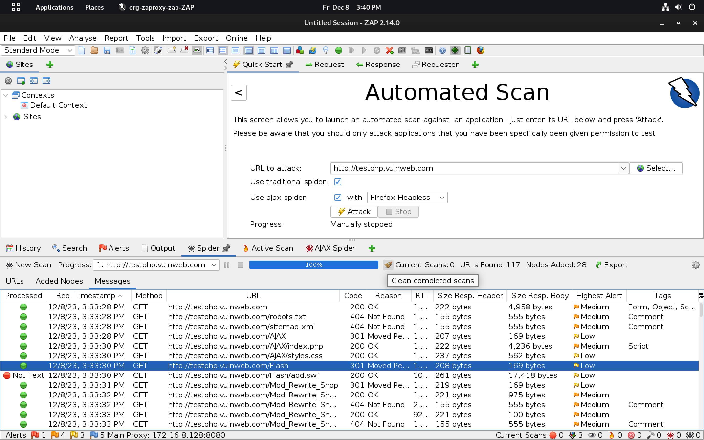

# Burp Suite Project Documentation

This README.md file documents the steps I took during the Burp Suite project. The project involved setting up a proxy, launching a target, performing spidering, vulnerability scanning, brute force attacks, and exploiting a known SQL injection vulnerability using Burp Suite.

## Table of Contents

- [Setup Proxy](#setup-proxy)
- [Launch Target](#launch-target)
- [Fast & Hybrid Spidering](#fast--hybrid-spidering)
- [Vulnerability Scan](#vulnerability-scan)
- [Brute Force Attack](#brute-force-attack)
- [Exploit SQL Injection](#exploit-sql-injection)

## Setup Proxy

I did the following steps to set up the proxy:

1. I opened Burp Suite and navigated to the "Proxy" tab.
2. I configured my browser to use Burp Suite as a proxy.
   - I set the proxy settings to:
     - Proxy Type: HTTP
     - IP: [Your Burp Suite IP]
     - Port: [Your Burp Suite Port]

## Launch Target

1. I identified the target website for testing.
2. I launched the target website in my browser.
3. I observed the requests captured in Burp Suite.

## Fast & Hybrid Spidering

1. I navigated to the "Target" tab in Burp Suite.
2. I used the "Spider" tool for fast and hybrid spidering (crawling) of the web application.

## Vulnerability Scan

1. I used the "Scanner" tool in Burp Suite for vulnerability scanning.
2. I analyzed the scan results and identified potential vulnerabilities.

## Brute Force Attack

1. I navigated to the "Engagement Tools" in Burp Suite.
2. I used the "Intruder" tool for brute force attacks.
3. I configured payload sets and ran the attack.

## Exploit SQL Injection

1. I identified a target page vulnerable to SQL injection.
2. I used the "SQLi" tool in Burp Suite to exploit the SQL injection vulnerability.

## Conclusion

This project demonstrated the effectiveness of Burp Suite by locating and fixing vulnerabilities in the online application. The practical experience highlights the significance of strong security protocols, and the knowledge acquired will benefit upcoming undertakings.

