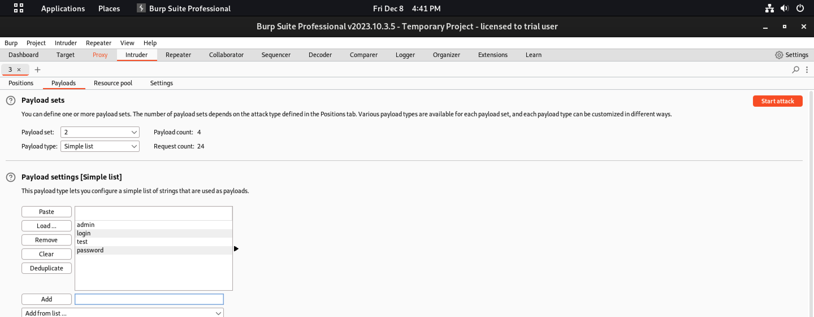

# Burp Suite Project Documentation

This README.md file documents the steps I took during the Burp Suite project. The project involved setting up a proxy, launching a target, performing spidering, vulnerability scanning, brute force attacks, and exploiting a known SQL injection vulnerability using Burp Suite.

## Table of Contents

- [Setup Proxy](#setup-proxy)
- [Launch Target](#launch-target)
- [Fast & Hybrid Spidering](#fast--hybrid-spidering)
- [Vulnerability Scan](#vulnerability-scan)
- [Brute Force Attack](#brute-force-attack)
- [Exploit SQL Injection](#exploit-sql-injection)

## Setup Proxy

I did the following steps to set up the proxy:

1. I opened Burp Suite and navigated to the "Proxy" tab.
2. I configured my browser to use Burp Suite as a proxy.
   - I set the proxy settings to:
     - Proxy Type: HTTP
     - IP: [127.0.0.1]
     - Port: [8080]

## Launch Target

1. I identified the target website for testing which was (http://testphp.vulnweb.com)
2. I launched the target website in my browser.
3. I observed the requests captured in Burp Suite.

## Fast & Hybrid Spidering

1. Spidering wasn't available on my version of Burpsuite so I made use of the OWASP ZAP tool.
2. Using this tool, I was able to perform a vulnerability scan and also carry out Spidering on my test web application.
3. I used the "Spider" tool for fast and hybrid spidering(crawling) of the web application.

## Vulnerability Scan

1. I used the "Scanner" tool in Burp Suite for vulnerability scanning.
2. I analyzed the scan results and identified potential vulnerabilities.
3. After analyzing the vulnerabilities, I identified a high-risk vulnerability which was SQL Injection amongst others.

## Brute Force Attack
Using the "Intruder tool" in burpsuite
1. After generating a request from the login page of the web application, I left-clicked the request and hit "Send to Intruder".
2. I used the "Intruder" tool for brute force attacks.
3. Under "Attack type" I selected "Cluster bomb" and started the attack
4. I configured payload sets (2) which were the lists of usernames and passwords to be tested and ran the attack.
     
5. After the scan was complete, I figured out that the correct inputs out of the list had the lowest status code and highest length.

## Exploit SQL Injection

1. I identified a target page vulnerable to SQL injection.
2. I knowingly inputted the wrong username and password and sent the request to Burpsuite, after this is sent the same request to "Repeater"
3. I then injected malicious sql statements in both username and password parameters. (uname=' or 1='1&pass=' or 1='1)
4. After sending this new request, a connection was established.

## Conclusion

This project demonstrated the effectiveness of Burp Suite by identifying vulnerabilities in the online application (http://testphp.vulnweb.com). The practical experience highlights the significance of strong security protocols, and the knowledge acquired will benefit upcoming undertakings.

